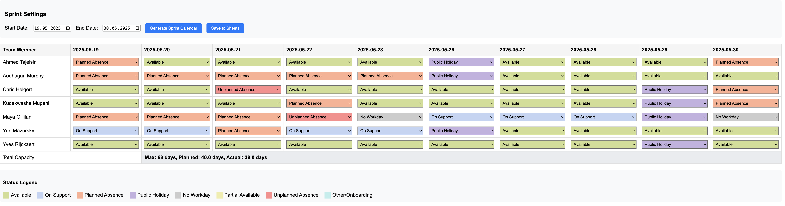

# Quick Start Guide for Engineering Managers

This guide will get you up and running with the Sprint Capacity Calculator in under 30 minutes.


*The application provides a visual calendar showing team availability and capacity*

## 🚀 Quick Setup (5 minutes)

1. **Navigate to folder and setup**
   ```bash
   cd SprintCapacityCalculator
   python setup.py
   ```

2. **Activate environment**
   ```bash
   # On macOS/Linux:
   source venv/bin/activate
   
   # On Windows:
   venv\Scripts\activate
   ```

## 🔧 Essential Configuration (10 minutes)

### 1. Update Team Data
Edit `config.py` and replace the `TEAM_DATA` with your team:

```python
TEAM_DATA = {
    'John Doe': {
        'capacity': 10,        # Daily story points capacity
        'location': 'US-CA',   # For holiday calculation
        'statuses': {}
    },
    'Jane Smith': {
        'capacity': 8,         # Part-time or reduced capacity
        'location': 'GB-EN',
        'nonwork': ['fri'],    # Doesn't work Fridays
        'statuses': {}
    }
    # Add all your team members...
}
```

### 2. Configure APIs
Edit the `.env` file with your credentials:

**Required for basic functionality:**
- `PD_API_KEY` and `PD_SCHEDULE_ID` (PagerDuty)

**Optional but recommended:**
- Workday credentials (for absence data)

## 🎯 API Setup (10 minutes)

### PagerDuty (Required - 5 minutes)
1. Go to PagerDuty → Configuration → API Access
2. Create API key with read permissions
3. Copy your schedule ID from the schedule URL
4. Add both to `.env` file

### Workday (Optional - 5 minutes)
1. Contact your Workday admin for API access
2. Get the time-off API endpoint
3. Add credentials to `.env` file


## 🏃‍♂️ Run the Application

```bash
python run.py
```

This will:
- Check your environment and dependencies
- Start the Flask server on port 5001  
- Automatically open your browser to the application

**Alternative:** If you prefer to manually activate the virtual environment:
```bash
source venv/bin/activate  # On Windows: venv\Scripts\activate
python app.py
```

## 📊 Using the Application

1. **Select sprint dates** (start and end)
2. **Click "Generate Calendar"**
3. **Review the capacity overview:**
   - Green = Available
   - Red = Unavailable/Absent
   - Yellow = Partial availability
   - Blue = Support/On-call

4. **Make manual adjustments** by clicking on any cell

## 🎨 Customization Tips

### Location Codes for Holidays
Try to include the correct region along with the country code, to have regional holidays covered. 
- `DE-BE`: Germany - Berlin
- `DE-BY`: Germany - Bavaria
- `GB-EN`: United Kingdom - England
- `IE`: Ireland
- `NL`: Netherlands
- `US-CO`: United States - Colorado (Denver)

### Capacity Guidelines
- `10`: Full-time developer (8 hours)
- `8`: Senior with meetings/responsibilities
- `6`: Part-time or significant other duties
- `4`: Very limited availability

### Status Meanings
- **Available**: Normal working capacity
- **Support**: On-call or support duties (100% capacity reduction)
- **Planned Absence**: Vacation, planned time off
- **Unplanned Absence**: Sick leave, short notice vacation
- **75%/50%/25% Available**: Partial availability

## 🔍 Troubleshooting

### Common Issues
1. **"No team members showing"** → Check `TEAM_DATA` in `config.py`
2. **"PagerDuty errors"** → Verify API key and schedule ID
3. **"No holidays showing"** → Check location codes format
4. **"Port already in use"** → Kill existing process: `lsof -ti:5001 | xargs kill -9`
5. **"python command not found"** → Use `python3` instead of `python`
6. **App won't stop** → Force kill: `pkill -f "python.*app.py"`

### Emergency Stop
```bash
# Kill the app if it's stuck
lsof -ti:5001 | xargs kill -9

# Or kill all Python processes (use with caution)
pkill -f python
```

---

**Need more details?** See the full [README.md](README.md) for comprehensive documentation. 
